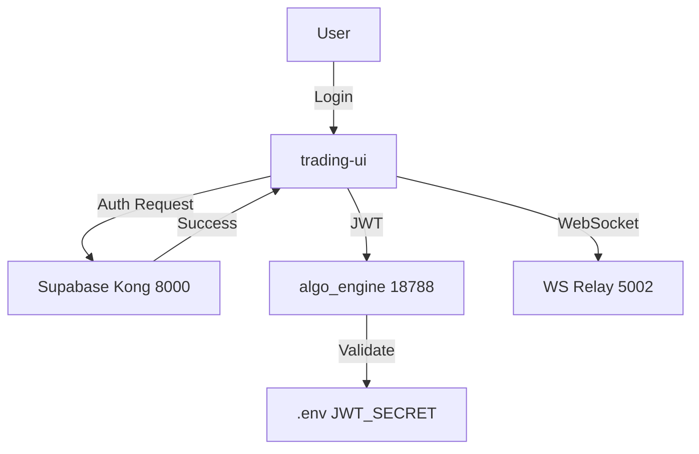
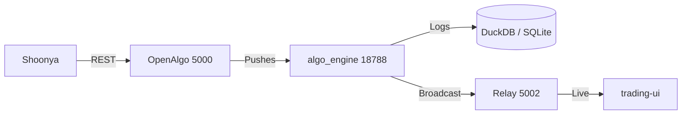

# AetherDesk Prime — Architecture Memory
# Type: Auto (agents update this via /update-memory after significant changes)
# Last updated: 2026-04-14 (Auto)

## Frontend Architecture
- **Framework**: React 18 + Vite + TypeScript (Shadcn UI + Framer Motion)
- **Styling**: Tailwind CSS (Glassmorphism / Premium Dark Mode)
- **State**: Supabase JS (Session) + Context/Hooks for Telemetry
- **Telemetry**: Bilingual WS Parser (handles OpenAlgo & AetherDesk payloads)
- **Port**: **80** (Production) | **3001** (Sync to Engine)

## Backend Architecture
- **Framework**: Flask (Synchronous REST API) + Async Strategy Loop
- **Core Engine**: `algo_engine` (managed by `algo-trader/main.py`)
- **Data**: DuckDB (Historify native storage) + SQLite (Trade logs/Risk) + Redis (Cache)
- **Unified Gateway**: Port **18788** handles all REST orchestration
- **WebSocket Relay**: Port **5002** broadcasts real-time ticks to UI
- **Auth**: JWT verification (Supabase compatible) + Shoonya OAuth Session Sync

## Auth Flow

## Data Flow (Ticks & Execution)

## Decision Log
| Date | Decision | Reason |
|------|----------|--------|
| 2026 | Port 18788 Unification | Merged AlgoDesk & OpenAlgo into a single control plane |
| 2026 | Port 5002 WS Relay | Provides a single, cleaned source of truth for the UI |
| 2026 | Flask for API | Thread-safe interaction with the core execution state |
| 2026 | DuckDB Historify | High-speed local OHLCV storage for institutional analytics |
| 2026 | Shoonya OAuth Sync | Automated headless session renewal via Selenium |
| 2026 | Login Flow Lockdown | Standardized JWT headers for cross-service authentication |
| 2026-04-15 | Metric Schema Consistency | Enforced full metric schemas with defaults (0.0) in DB to prevent UI crashes | Stable |
| 2026-04-15 | Auth UI Normalization | Refactored ForgotPassword logic to match Auth.tsx (Zod + Shadcn) | Standards |
| 2026-04-15 | A11y Guardrails | Implemented aria-hidden decorative patterns across Auth module icons | Standards |
| 2026-04-15 | Premium Switch System | Redesigned `Switch` with glassmorphism & unified toggle protocols | Standards |
| 2026 | Nginx Routing Proxy | Stabilized Port 80 for production frontend access |

## [Agents: add new decisions here when architecture changes are made]
