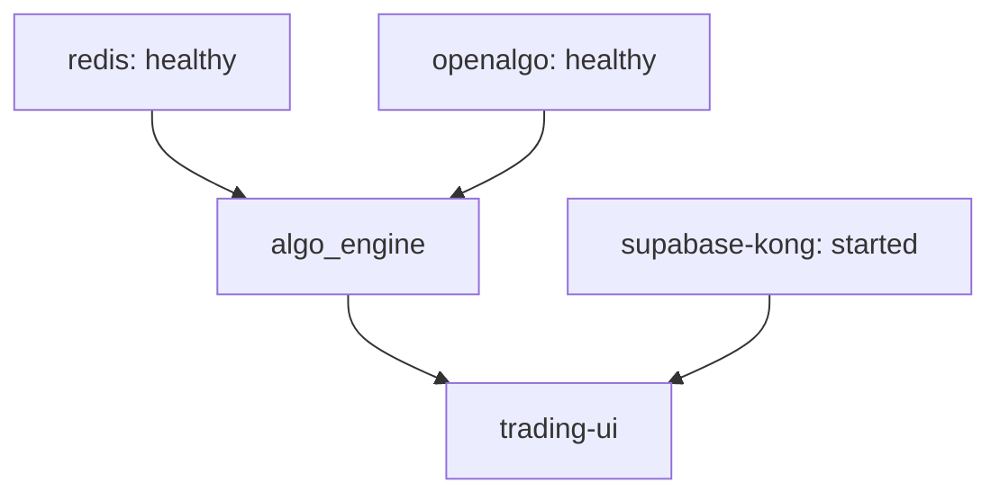

# Docker & Infrastructure Audit — ARM64 Optimizations

## 1. Required Healthcheck Templates (AetherDesk Prime)

### Flask Engine (algo_engine: 18788)
```yaml
healthcheck:
  test: ["CMD", "python3", "-c", "import urllib.request; urllib.request.urlopen('http://localhost:18788/health')"]
  interval: 10s
  timeout: 5s
  retries: 5
  start_period: 20s
```

### Redis (openalgo_redis: 6379)
```yaml
healthcheck:
  test: ["CMD", "redis-cli", "-a", "${REDIS_PASSWORD}", "ping"]
  interval: 10s
  timeout: 5s
  retries: 5
```

### UI Builder (ui-builder: Bun)
```yaml
healthcheck:
  test: ["CMD", "node", "-v"] 
  interval: 30s
  timeout: 10s
  retries: 3
```

## 2. Boot Order Graph (Health-Gated)


## 3. Resource Constraints (AetherDesk Prime Scorecard)
Based on Oracle ARM (24GB RAM):
| Container | mem_limit | Focus |
|-----------|-----------|-------|
| `supabase-db` | 2GB | Data persistence |
| `algo_engine` | 1.5GB| Tick processing |
| `trading-ui` | 128MB | Nginx serve |
| `ui-builder` | 4GB | Bun/Vite build (Heavy) |
| `local_ollama`| 6GB | AI Inference |
| `openalgo-web`| 1.5GB| Broker Proxy |

## 4. Network Isolation Policy
- **`trading_net`**: The primary backbone for all service interaction.
- **Port Mapping Constraints**:
  - `18788`, `5002`: Broadcast to host (Trading Gateway).
  - `80`, `3001`: Broadcast to host (UI Frontline).
  - `8000`, `8443`: Broadcast to host (Auth/API Gateway).
  - `11434`: Broadcast to host (AI Engine).
  - All internal DBs: **Exposed only**, no host port mapping unless debugging.

## 5. ARM64 Base Image Checklist
- `python:3.12-slim`: Core Engine.
- `oven/bun:latest`: UI Builder.
- `nginx:1.25.4-alpine`: UI Serve.
- `supabase/postgres:15.1.1.78`: DB core.

## 6. [Agents: add new infrastructure constraints here]
